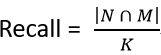
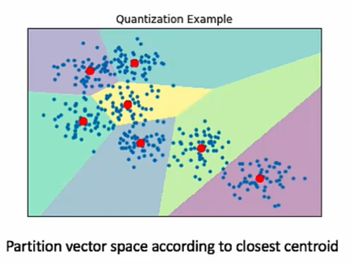
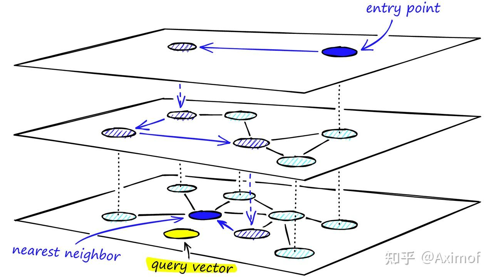

FAISS：
FAISS是一个向量数据库，可以存储向量，并计算相似度。


搜索算法
除了暴力搜索能精确搜索到近邻，所有搜索算法只能在性能、召回率、内存三者之间进行权衡。

常见的向量度量有四种：欧式距离、余弦、内积、海明距离不同的度量方式对应不同的场景，通常欧式距离用于图片检索，余弦用于人脸识别，内积多用于推荐，海明距离由于向量比较小，通常用于大规模视频检索

场景。

有了度量以后，我们通常会用召回率（也通常叫精度）来评估向量检索的效果，对于给定的向量q，其在数据集上的K近邻为N，通过检索召回的K个近邻集合为M，



召回越接近100%代表索引效果越好。

**基于树的方法**

基于树的方法有很多种，比较典型的有KDTree、BallTree、VPTree，类比传统的二叉树，树结构无非是在建树的时候是决定往左还是往右扩展，不同的向量树
索引在于按照什么标准去决策，KDTree（如图1所示）会选取向量中某个方差最大的维度取中值作为判定标准，也就是以超平面去划分空间，而BallTree则以球面去划分空间，VPTree会先选取一个制高点，然后计算每个点和制高点的距离，取距离中值作为判定标准。通常这些方法在检索的时候都会利用三角形不等式

来去除不必要的探索。

基于树的方法还有很多其他类型，但万变不离其宗，无非就是按照某个判定标准，对向量空间
进行划分，但不管怎么划分，由于需要回溯的，都决定了基于树的方法在性能上要稍逊一筹。

**基于哈希的算法**

上面的表达式用人话来说就是：高维空间的两点若距离很近，那么设计一种哈希函数对这两点进行哈希值计算，使得他们哈希值有很大的概率是一样的，若两点之间的距离较远，他们哈希值相同的概率会很小。不同距离度量的哈希函数不同，不是所有距离度量（如内积）都能找到对应局部敏感哈希

ANNS:
寻找相邻最近的算法，来评估相似向量间的相似度。

·先对DB向量进行聚类，然后对每个聚类进行搜索，最后合并搜索结果。


利用faiss的hnsw算法，可以快速找到相似向量。
在python中测试：


**基于倒排方法**

传统倒排索引是根据文档包含某个词，然后将当前文档放入该词的倒排索引中来建立索引结构，那向量是如何建立起倒排索引呢？通过聚类把整个向量空间划分为K个区域，每个区域用一个中心点C代替，这样每个向量和所有中心点对比，将自身归入到距离自己最近的中心点对应的倒排，整个索引结构就建立起来了，如图2。

**基于图的方法**

前面介绍的索引结构都可以归类为基于空间划分的方法，每个向量只会属于某个划分好的一个区域，这些方法最大的的问题是为了提高召回需要考察很大一块区域的向量，导致计算量激增，那有没有更好的方法来解决这个问题呢？基于图的方法就可以比较好的实现这一目标，图方法最朴素的想法是邻居的邻居也可能是邻居，这样把最近邻的查找转化为图的遍历

，由于其连通性，可以针对性的考察部分向量而不是按区域来考察，因此可以大幅降低向量的考察范围。

最近几年图方法是向量检索研究的一个热点，出现了如KGraph、NSG、HNSW、NGT等一批图索引方法，但实际上这些图方法的主要区别在构建过程，不同图方法采用不同的手段来提升图的质量，但图检索的步骤基本是一致的：a.选好入口点；b.遍历图；c.收敛。在不断实践中我们观察到一些特性来评判图索引质量，指引我们在图方法改进的方向：

HNSW:

创建 HNSW

HNSW 是 NSW 的自然演化，它从 Pugh 的概率跳表结构中汲取了灵感，添加了层级的概念。

向 NSW 中添加层级会产生一个图，其中的链接在不同的层之间分离。在顶层，我们拥有最长的链接，在底层，我们拥有最短的链接。

HNSW的分层图，顶层是我们的入口点，只包含最长的链接，随着我们往下移动，链接长度变得越来越短，越来越多。

在搜索过程中，我们进入顶层，找到最长的链接。这些顶点往往是高度顶点（具有在多个层之间分离的链接），这意味着我们默认情况下会从 NSW 中的缩小阶段开始。

我们沿着每个层的边缘遍历，就像我们在 NSW 中所做的那样，贪婪地移动到最近的顶点，直到找到一个局部最小值。与 NSW 不同的是，此时我们转移到较低层中的当前顶点，并开始再次搜索。我们重复这个过程，直到找到底层（层 0）的局部最小值。


通过多层结构的HNSW图的搜索过程


clone下来faiss的代码，在faiss/utils/random.h中
```cpp
// 默认随机数生成器是 std::default_random_engine 类型别名定义的随机无符号整数的通用源
// default_random_engine默认引擎
// typedef mt19937 default_random_engine;
std::default_random_engine level_generator_;
std::default_random_engine update_probability_generator_;

level_generator_.seed(random_seed);
update_probability_generator_.seed(random_seed + 1);

int curlevel = getRandomLevel(mult_);
int getRandomLevel(double reverse_size) {
    // 产生均匀分布在区间 [a, b) 上的随机浮点值 i ，分布按照概率密度函数 p(i|a,b)=1/(b-a)
    std::uniform_real_distribution<double> distribution(0.0, 1.0);
    double r = -log(distribution(level_generator_)) * reverse_size;
    return (int) r;
}

// 若 M=16
// mult_ = 1 / log(1.0 * M_) = 1 / ln(16.0) ≈ 0.360674
```

