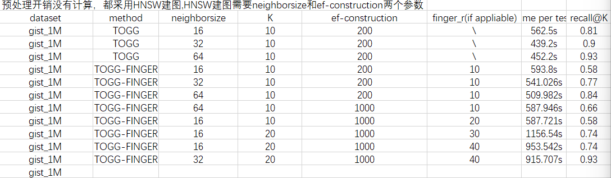

在gist1M数据集上跑出来的结果：（togg作为已有论文方法的对比）

对于单次L2距离询问，在togg上一次是O(dim);在预处理后的finger上是O(r).在r << dim的情况下，理论上是有性能优势的；但是在r特别小的情况下，可能会导致估计失误从而导致访问了更多节点导致性能变差。

在其他条件相同的情况下：（未计算预处理的时间）

neighborsize越大，预处理的时间会越长；但是与此同时，单次top-k的询问时间会变短；recall@K也会变高。

ef-construction越大，建出的HNSW图质量会越高，从而使得搜索的时限变短。
（efConstruction 越大，构造时间越长，index quality越好。有时，efConstruction 增加的过快并不能提升index quality。有一种方法可以检查efConstruction 的选择是否可以接受。计算recall，当ef=efConstruction ，在M值时，如果recall低于0.9，那么可以适当增加efConstruction 的数值。）

之后可能可以优化的地方：
采用nsw建图；另外可能还需对多种数据集进行进一步测试。
同时还需要与hnsw自带的topk对比。（recall比hnsw自带的topk要高，时限更久）