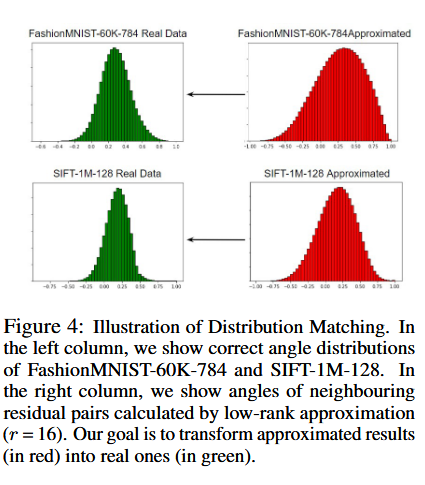
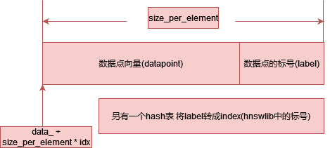
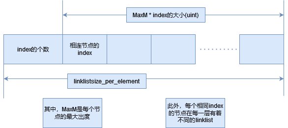

## FINGER：

- 观察出结论：大多数距离计算对更好的搜索结果没有产生贡献。（启发式算法）
也就是说，可以设置一个距离上界，当搜索的距离超过这个上界，则不参与计算。（剪枝）可以采用近似计算来减少计算量。

计算最近点的算法（算法1，即贪心算法）：
- 给定图G，一个询问点q，起始点p，求dist的函数以及邻域的数量。
- 终止循环条件：当前访问点到点$q$的距离超过了结果集合中的最远距离。
- 对于每个bfs更新的当前点而言，将这部分点的邻域加入比较。如果有更好的结果或者结果集合没有满，则加入优先队列。
- 同时，每次寻找完更新点，保证结果集T的大小不超过一个特定值。

给定问题：

给出一个询问点$q$，以及一个中心点$c$。对于一个$c$的特定的最近点集$d$，我们通过计算$q$和$d$的距离来更新查找的results。

采用L2距离。一个想法是可以把$c$进行正交分解。最后可以分解成一个正交和一个投影方向的向量。

由此可以得到：

$q = q_{proj} + q_{res},q_{proj} = \frac{c^Tq}{c^Tc}c,q_{res}=q-q_{proj}$

由此L2距离可以写成：

$|Dist|^2 = ||q - d||_2^2 = ||(q_{proj} - d_{proj})+(q_{res}-d_{res})||^2_2=||(q_{proj} - d_{proj})||^2_2 + ||(q_{res}-d_{res})||^2_2 = ||q_{proj}||^2_2 + ||d_{res}||^2_2 - 2q^T_{res}d_{res}$

$d_{proj}$和$d_{res}$在建图的时候就可以得到了；$||q-c||_2$在搜索算法运行的时候就已经被计算过了。因此可以通过一个计算得到$q^Tc$:

$q^Tc = \frac{||q|^2 + ||c||^2_2 - ||q-c||^2_2}{2}$

由此$q_{proj}$可以计算得到。唯一的未知项便是$q_{res}^Td_{res}$。需要设计一个近似量来模拟$cos(q_{res},d_{res})$。

当q和d的距离小于一个阈值时，可以认为q和d是近的。此时我们只需要考虑d中的点满足的关系。（也就是q的邻域中的cos值满足的关系）此时，d中向量的cos值会服从一个高斯分布。我们由此可以设计一个算法来满足这个模拟。

这个cos值服从正态分布

#### RPLSH

使用位置敏感哈希及其变体来实现对正态分布中随机采样的近似。

RPLSH从正态分布中随机采样r个向量，形成一个投影矩阵 $P \in R^{r \times m}$。$m$是询问向量的维度。$L2$距离可以通过这个投影矩阵进行量化。所产生的误差是$|| ||Px - Py||^2_2 - || x - y ||^2_2 ||_2$

X,Y之间的角度可以用汉明距离来估计：

$hamm(sgn(Px),sgn(Py)) \frac{\pi}{r}$

个人理解:如果这两个向量特别近,那么哈希出来的结果应该也是相似(取样),这里采用了最简单的sign函数.

因此可以得到一个估算式：
    $\mathop{\arg min}\limits_{P \in R^{r \times m}}E_{x,y \sim D_{res}} ||||P_x - P_y||^2_2 - || x - y ||^2_2 ||_2$

采用SVD算法(奇异值分解 todo)来解决这个最优化问题

给定一个残差向量矩阵 $D_{res} \in R^{m×N}$ ，并将 $D_{res} = USV^T$ 表示为 Dres 的奇异值分解。$U_{1:r}$，U 的前 r 列是优化问题方程的最优解。

#### 匹配高斯分布

对于该cos值,它理论上是一个高斯分布.但实际上并不是.

它的均值偏离了一段距离,方差大于了实际数据的分布.
因此,可以用数据来进行拟合.

假设相邻向量的角度服从高斯分布$N(\mu,\sigma)$,近似的角分布为：$N(\hat\mu,\hat\sigma)$.给定特定的x,y和投影矩阵P,我们可以计算出近似角$\hat{t} = cos(Px,Py)$.假设这个x,y来自$N(\hat\mu,\hat\sigma)$的概率分布,那么该值最后可以通过$t = (\hat{t} - \hat\mu)\frac{\sigma}{\hat\sigma} + \mu$进行转换.转换后的角度服从$N(\mu,\sigma)$.参数$\hat\mu$,$\hat\sigma$,$\mu$和$\sigma$可以通过数据来估计.

#### FINGER

一旦确定好投影矩阵P，就可以开始进行搜索了.当然,这种分布匹配方案也会产生错误,所以我们会进一步计算实际角度和近似角度之间的平均L1误差,用作误差校正项.将这个信息保存在搜索索引之后,可以近似查询q和数据点d之间的距离.

减少距离的计算

已经复现了hnsw建图以及搜索算法(上文算法1).

hnswlib中没有给出具体建图的api
./hnswlib/hnswalg.h 的 loadindex方法中：

在连边的过程中，hnswlib插入点的存储方式是：

边的存储方式为：

尝试复现FINGER以及DISKANN算法

todo 
Product Quantization
HNSW建图
learning to route in similarity graphs

