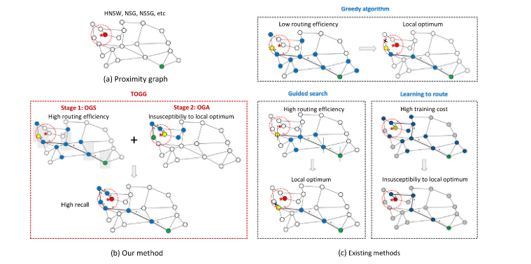
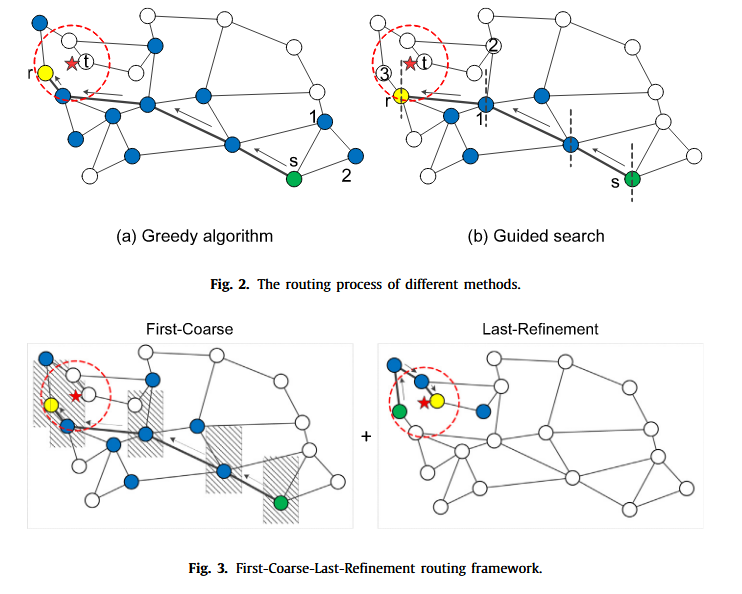
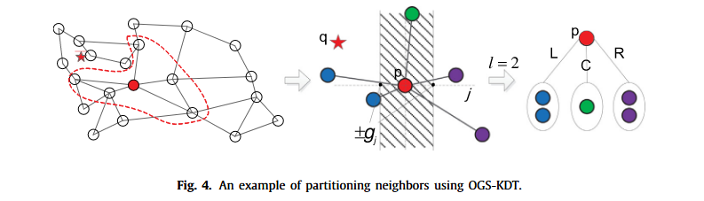

### Two-stage routing with optimized guided search and greedy algorithm on proximity graph

例如，路由可以显式划分为两个细粒度阶段：（S1） 远离查询的路由阶段和 （S2） 靠近查询的路由阶段。

在S1中，我们更关心如何快速定位到查询的邻域，以便可以尽快路由到它。

在S2中，我们更加关注如何完整地访问查询附近的点，从而能够获得足够准确的搜索结果。在这个阶段，精度要求超过了效率要求。此时需要查询附近的部分邻居。

由此可以得出一个新的路由策略，具有优化引导搜索和贪婪算法的两阶段的路由策略。

- 在搜索路径上，贪心算法访问每个顶点的所有邻居，但是，引导式搜索仅访问与查询方向相同的邻居。因此，引导式搜索有更高的路由效率。因为它访问的邻居比贪心算法少。对于下图中的1与2节点则没有必要进行访问，因为可能会让它们访问的节点绕路的概率比较高。

- 在贪心算法搜索的过程中，当对顶点r进行路由搜索时，它终止了查询。但是r并不是离查询最近的节点，t才是。此时陷入局部最优。

- 当对顶点1执行路由的时候，其编号为2的邻居将不会被访问，因为和它查询的方向不同。此时，引导式搜索处于局部最优。

根据上述示例，贪婪算法的路由效率较低，容易陷入局部最优。虽然引导式搜索的路由效率很高，但会大概率错过一些重要的路径，并且容易受到局部最优的影响（尤其是在查询附近）。

#### OGS-kd-tree算法

对于每一维度，当访问到当前维度时，使用不同的划分方法将当前点集划分成两份。（二分,在这里是三分）分的太多会显著降低recall。

对于在一定区间范围内的点集，把它们划分到C集合中。（C集合便是需要搜索的点）

这个方法缺点：计算了太多次的距离。是贪心搜索的五倍。

#### Optimized guided search based on KMC

kd-tree只考虑了当前的维度，我们找到一种方法考虑所有的维度。因此可以通过K-means聚类划分邻居集，并访问集群中从查询到集群中心距离最小的邻居。

仅访问一个聚类中的相邻要素进行距离计算;因此，我们可能会错误地认为集群越多，距离计算就越少。但实际上，因为集群的选择也需要距离计算，当集群的数量达到一定限制时，随着集群数量的增加，距离计算的数量也会增加。

#### 优化后的贪心算法

在查询附近的路由阶段，根据查询的方向继续访问邻居是不合理的。
该算法不仅考虑邻域，同时也访问了邻域的邻域。这个算法放松了对于扩张的限制，因此提高了准确率。

#### TOGG算法

这个算法分了两个搜索阶段：

1. 离查询点比较远：
使用OGS-KDT或者OGS-KMC得到的C集合，直到C集合中的点没有被访问到为止。
（这个算法产生了很多次的距离比较）

2. 离查询点比较近：
将C集合中访问的点标记为未访问，使用OGA算法进行搜索。直到C集合中的所有点都已经被访问到为止。

todo:
调节neighborhood size，可以调节搜索的精度和效率
根据数据集，测试出不同算法的召回率和qps，绘制出折线图